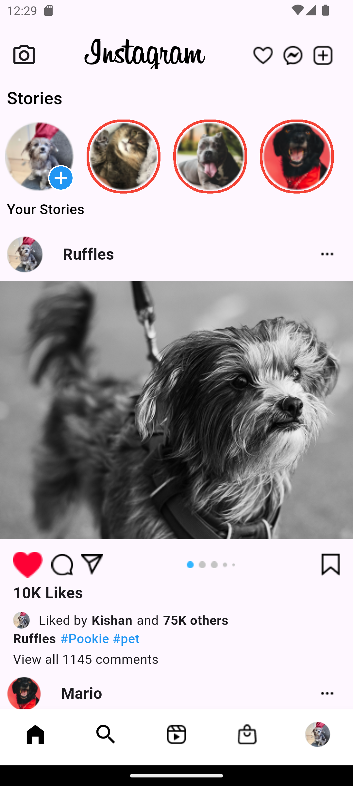
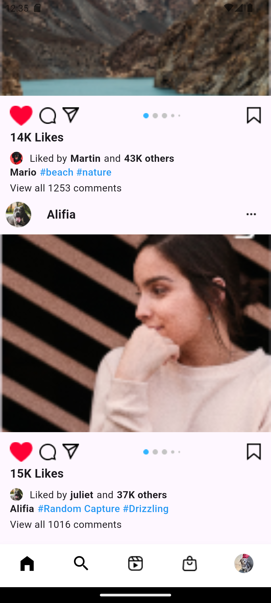

# 📱 Instagram UI Clone

> A pixel-perfect Flutter recreation of Instagram's home feed interface with interactive stories, posts, and navigation.

[](https://flutter.dev/)
[](https://dart.dev/)

## ✨ Features

- 🎨 **Authentic Instagram Design** - Pixel-perfect recreation of Instagram's UI
- 📖 **Interactive Stories** - Circular avatars with gradient borders and add story functionality
- 📝 **Dynamic Posts** - Complete post structure with user profiles, images, and engagement metrics
- ❤️ **Interactive Elements** - Like, comment, share, and bookmark functionality
- 🧭 **Bottom Navigation** - Full navigation bar with home, search, reels, notifications, and profile
- 📱 **Responsive Layout** - Optimized for different screen sizes with proper spacing
- 🔄 **Smooth Scrolling** - Seamless vertical scrolling through the feed
- 📲 **Collapsible AppBar** - SliverAppBar that hides/shows on scroll for immersive full-screen experience

## 📸 Screenshots

| Home Screen | Stories Section | Posts Feed |
|-------------|-----------------|------------|
|  |  |  |

## 🚀 Getting Started

### Prerequisites

- Flutter SDK `>=3.7.2`
- Dart SDK `>=2.19.0`
- Android Studio / VS Code
- Android/iOS device or emulator

### Installation

1. **Clone the repository**
   ```bash
   git clone https://github.com/yourusername/instagram_ui.git
   cd instagram_ui
   ```

2. **Install dependencies**
   ```bash
   flutter pub get
   ```

3. **Run the application**
   ```bash
   flutter run
   ```

## 📁 Project Structure

```
instagram_ui/
├── lib/
│   ├── main.dart              # Application entry point
│   └── home.dart              # Main home screen with complete UI
├── assets/
│   └── images/                # UI assets and icons
│       ├── Avatar.png         # User profile images
│       ├── post 1.png         # Post content images
│       ├── redheart.png       # Interaction icons
│       └── ...
├── screenshots/               # App screenshots for README
│   ├── Screenshot_1.png
│   ├── Screenshot_2.png
│   └── Screenshot_3.png
├── .gitattributes             # Git file handling configuration
├── pubspec.yaml               # Dependencies and assets
└── README.md
```

## 🎯 Key Components

| Component | Description |
|-----------|-------------|
| **SliverAppBar** | Collapsible Instagram branding with camera, notifications, and messenger icons |
| **Stories Section** | Horizontal scrollable stories with gradient borders and add functionality |
| **Post Cards** | Complete post structure with user info, images, and interaction buttons |
| **Bottom Navigation** | Five-tab navigation matching Instagram's layout |
| **Engagement Metrics** | Like counts, user interactions, and comment previews |
| **NestedScrollView** | Advanced scrolling behavior with floating/snap AppBar functionality |

## 🛠️ Built With

- **[Flutter](https://flutter.dev/)** - UI framework for cross-platform development
- **[Dart](https://dart.dev/)** - Programming language optimized for UI
- **Material Design** - Google's design system for consistent UI components

## 📱 Supported Platforms

- ✅ Android
- ✅ iOS
- ✅ Web (with responsive design)

## 🤝 Contributing

Contributions make the open source community amazing! Any contributions are **greatly appreciated**.

1. Fork the Project
2. Create your Feature Branch (`git checkout -b feature/AmazingFeature`)
3. Commit your Changes (`git commit -m 'Add some AmazingFeature'`)
4. Push to the Branch (`git push origin feature/AmazingFeature`)
5. Open a Pull Request

## 📄 License

Distributed under the MIT License. See `LICENSE` for more information.

## 🙏 Acknowledgments

- [Instagram](https://instagram.com) for the original design inspiration
- [Flutter Community](https://flutter.dev/community) for excellent documentation and support
- [Material Design](https://material.io/) for comprehensive design guidelines

---

**Made with ❤️ using Flutter**  
**⭐ Star this repo if you found it helpful!**